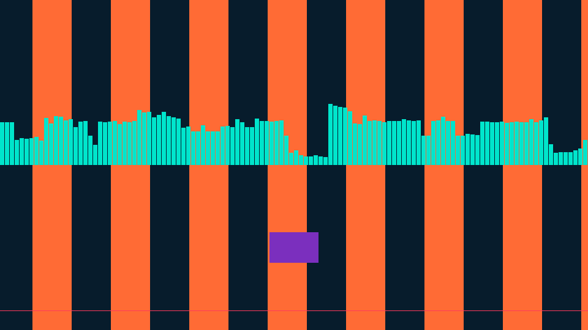

# Overview

A modern *Platform Layer* for XCB software rendering.

See the [X11/XCB Platform Layer for Software Rendering](https://t-cadet.github.io/programming-wisdom/#2026-03-29-an-x11-xcb-platform-layer-for-software-rendering) article for some background and a code walk-through.

## Getting started

```bash
gcc -std=c23 -O2 -g -Wall -Wextra main.c -lxcb -lxcb-dri3 -lxcb-present -lxcb-cursor -lxcb-render -lxcb-sync -lxcb-keysyms -o main
./main
```

## Gallery



